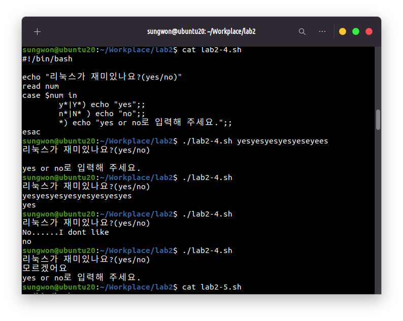

# Lab 2. Ubuntu 실습 + Shell scripting

- lab2-0.sh --> Hello World를 출력

```
echo 명령어를 이용해 문자열을 출력
```
- lab2-1.sh --> 숫자를 입력 받아 hello world를 여러 번 출력

```
$1 인자를 받아와 그 숫자만큼 for loop를 실행
```
- lab2-2.sh --> 두 숫자와 연산자(+ 또는 -)를 입력 받아 계산

```
$1, $3 인자의 덧셈과 뺄셈을 계산하여 변수에 저장, 조건문에서 $2 인자의 연산자를 확인해 값에 따라 덧셈 또는 뺄셈으로 출력
```
- lab2-3.sh --> 체질량 지수 (BMI) 계산하여 비만 여부를 판단

```
인자로 받아온 몸무게와 키의 제곱을 먼저 변수에 저장, bmi를 bc연산으로 계산 후 저장하여 조건문에서 값을 확인하여 문자열 출력
```
- lab2-4.sh --> case문을 활용한 예제 실습 (p.439)

```
정규표현식을 이용해 y or Y로 시작하는 문자는 yes, n or N 으로 시작하는 문자는 no를 출력하고, default는 경고문구를 출력
```
- lab2-5.sh --> 내부 함수를 만들어 리눅스 명령어(e.g. ls)를 실행

```
ls 명령어를 실행하는 함수를 선언하고 실행
```
- lab2-6.sh --> 입력된 폴더가 있는 확인. 압축 및 해제를 수행

```
-d로 디렉토리가 존재하는지 확인. 인자로 받은 디렉토리 이름이 존재하면 지우고 존재하지 않다면 생성함
for loop로 다섯개의 파일을 touch명령어로 생성하고 생성 후 tar압축을 실행, 디렉토리를 생성해 압축파일을 이동시키고 생성한 디렉토리에서 압축을 해제한다.
```
- lab2-7.sh --> 파일 생성 및 해당 파일을 링크

```
2-6과 마찬가지로 인자로 받아온 디렉토리명이 존재하면 생성, 존재하지 않으면 제거
for loop를 만들고 그 안에서 생성한 디렉토리 위치로 이동해 파일을 생성하고 그 파일명을 이름으로 하는 디렉토리를 만들어 그 위치로 이동, 이동한 위치에 심볼릭 링크를 생성한다
```
- lab2-8.sh --> 이름과 생일 또는 전화번호를 DB.txt에 기록

```
DB.txt가 존재하지 않으면 DB.txt 생성
$*로 모든 인자를 DB.txt에 저장 할 수 있도록 한다('>'는 처음 위치부터 쓰기, '>>'는 마지막 위치부터 쓰기)
```
- lab2-9.sh --> 이름으로 검색. DB.txt에서 검색된 정보를 확인

```
grep 명령어로 인자로 받아온 문자열이 DB.txt에 위치하는 Line을 출력함
```